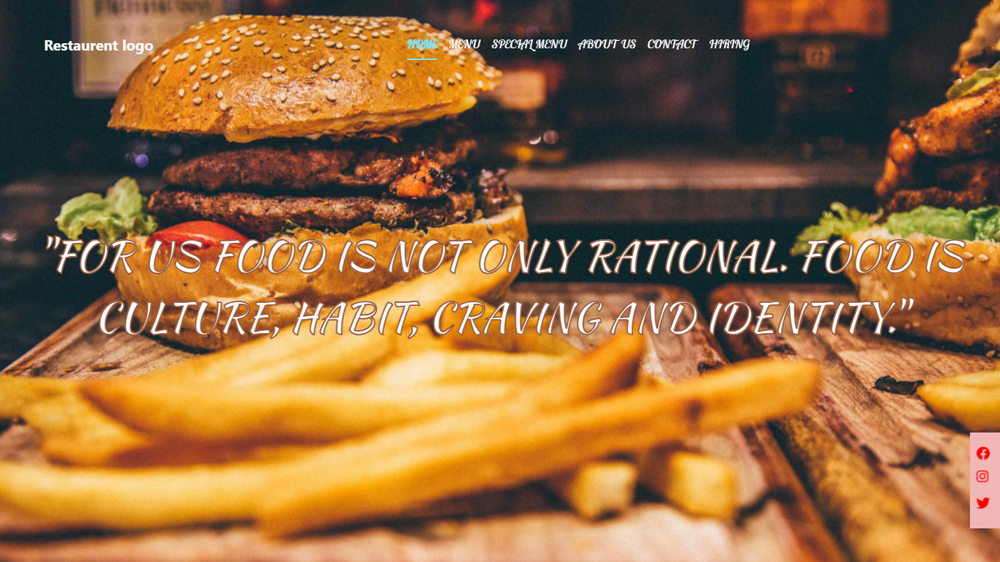
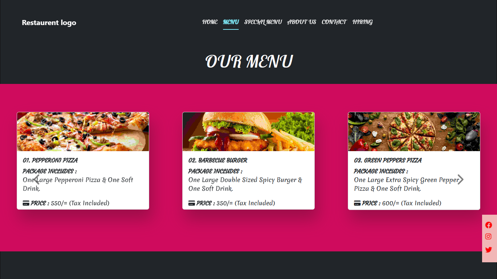
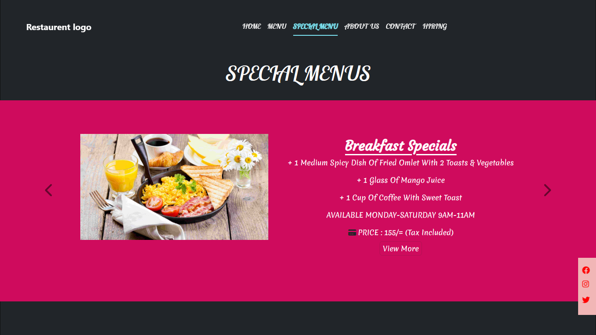
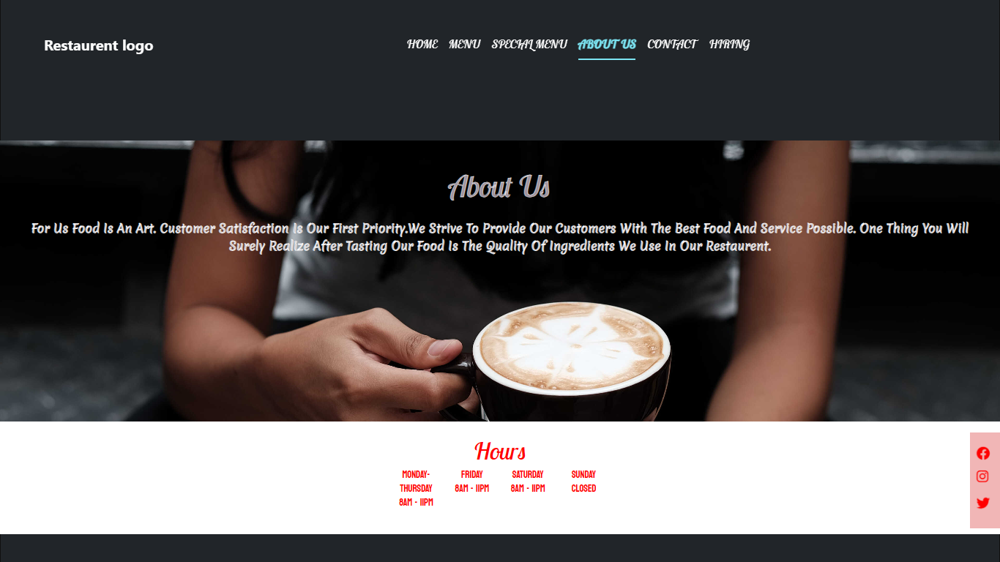
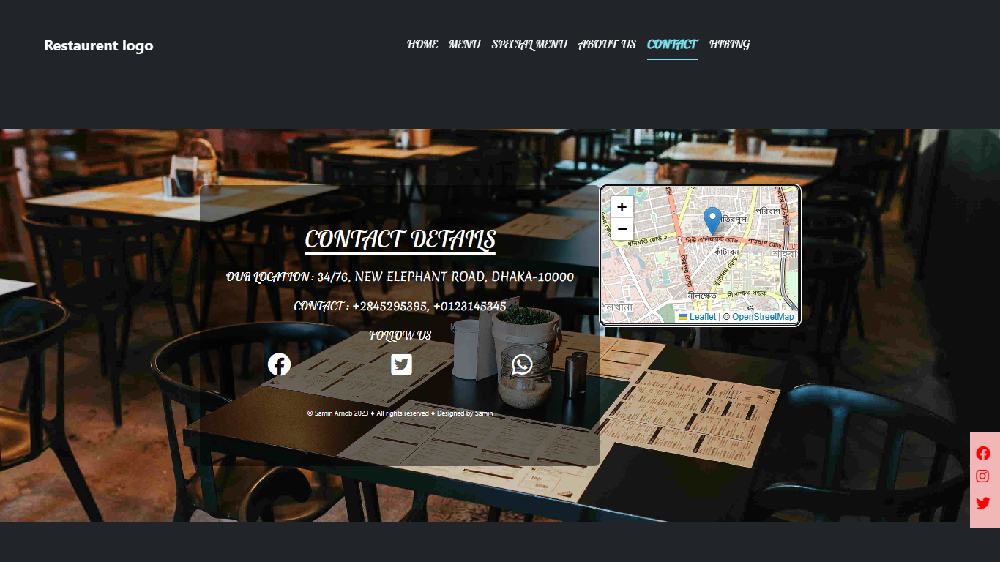

# Restaurant_Web_Design_With_Es7_Bootstrap5

The whole project is created to make a restaurent web page according to the owner's choice.
You can use it if you like just mail me and give credit kindly.

## Website Link 

- https://saminkirigaya.github.io/Restaurant_Web_Design_With_Es7_Bootstrap5.github.io/

## Website Demo
- 
- 
- 
- 
- 

## Features Updated

- Sliding effect with window scrolling
- Opacity effect with window scrolling
- Carousal item animation effect
- Full responsive design with bootstrap 5
- All effect are created with only Es7 no need for any JS module

## Run Locally

Just clone the project, keep in the root of you hosting and enjoy with index page !!!
## Optimizations

Added more responsive view for different displays.
Made carousel effect optimized with respect to the device dislay change.
